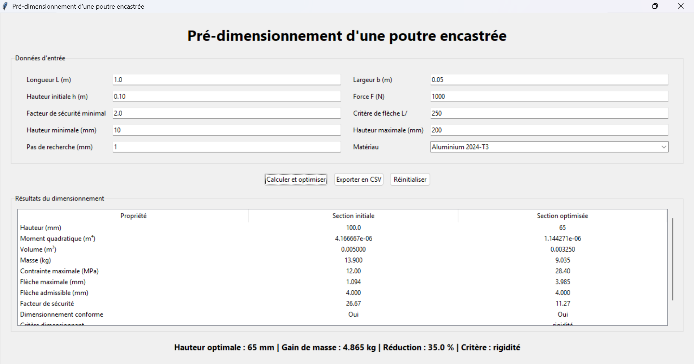
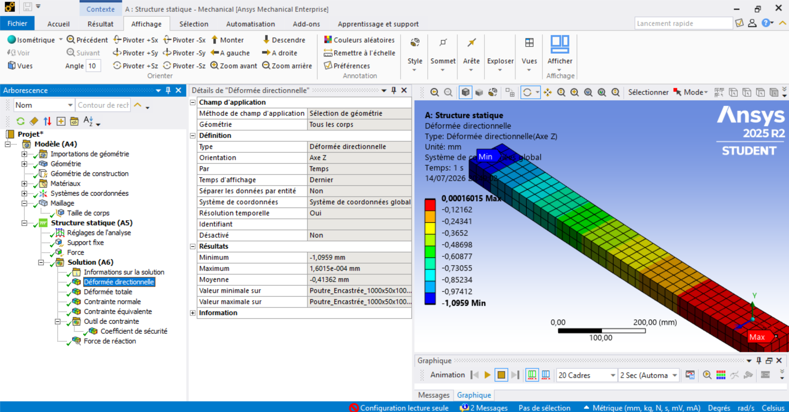

# Outil de pré-dimensionnement d’une poutre encastrée


Application Python permettant de vérifier et d’optimiser une poutre encastrée à section rectangulaire soumise à une force ponctuelle à son extrémité libre.

Le projet combine :

- résistance des matériaux ;
- calcul scientifique en unités SI ;
- recherche discrète d’une section minimale ;
- comparaison de masse ;
- interface graphique Tkinter ;
- export CSV ;
- vérifications automatiques avec `pytest`.

## Interface



L’interface accepte les dimensions, la charge, le matériau, le facteur de sécurité minimal, le critère de flèche et la grille d’optimisation.

## Résultat du cas de référence

Données utilisées :

- matériau : Aluminium 2024-T3 ;
- longueur : `1,00 m` ;
- largeur : `0,05 m` ;
- hauteur initiale : `0,10 m` ;
- force appliquée : `1000 N` ;
- facteur de sécurité minimal : `2,00` ;
- flèche admissible : `L/250`.

| Grandeur | Section initiale | Section optimisée |
|---|---:|---:|
| Hauteur | 100 mm | 65 mm |
| Masse | 13,900 kg | 9,035 kg |
| Moment quadratique | 4,166667 × 10⁻⁶ m⁴ | 1,144271 × 10⁻⁶ m⁴ |
| Contrainte maximale | 12,00 MPa | 28,40 MPa |
| Flèche maximale | 1,094 mm | 3,985 mm |
| Flèche admissible | 4,000 mm | 4,000 mm |
| Facteur de sécurité | 26,67 | 11,27 |
| Conforme | Oui | Oui |

La reconstruction retrouve une hauteur minimale de `65 mm`, avec une réduction de masse de `35,0 %`.

Le critère dimensionnant est la rigidité : la flèche optimisée utilise environ `99,6 %` de la limite admissible.

## Validation numérique sous ANSYS Mechanical

Le cas analytique de référence a également été reproduit avec une analyse statique linéaire sous ANSYS Mechanical.

Les mêmes dimensions, le même matériau et le même chargement ont été utilisés :

- longueur : `1 000 mm` ;
- largeur : `50 mm` ;
- hauteur : `100 mm` ;
- force appliquée : `1 000 N` ;
- matériau : Aluminium 2024-T3 ;
- module de Young : `73,1 GPa` ;
- coefficient de Poisson : `0,33`.

### Comparaison Python–ANSYS

| Grandeur | Modèle Python | ANSYS | Écart relatif |
|---|---:|---:|---:|
| Flèche maximale | 1,0944 mm | 1,0959 mm | environ 0,14 % |
| Contrainte | 12,00 MPa | 12,525 MPa | environ 4,38 % |
| Facteur de sécurité | 26,67 | 25,55 | — |
| Réaction suivant Z | — | 1 000 N | équilibre vérifié |

Une étude de convergence a été réalisée avec des tailles de maillage de `50 mm`, `25 mm` et `12,5 mm`.

Le maillage de `25 mm`, composé de 2 117 nœuds et 320 éléments, a été retenu comme compromis entre précision et coût de calcul. La variation de la flèche entre les maillages de `25 mm` et `12,5 mm` est d’environ `0,082 %`.

Les contraintes locales près de l’encastrement restent sensibles au raffinement du maillage et doivent être interprétées avec prudence.



[Consulter l’étude ANSYS complète](validation_ansys/README.md)

## Fonctionnalités

- calcul du moment quadratique d’une section rectangulaire ;
- calcul du moment maximal à l’encastrement ;
- calcul de la contrainte maximale de flexion ;
- calcul de la flèche selon Euler-Bernoulli ;
- calcul du volume et de la masse ;
- calcul du facteur de sécurité ;
- vérification de la résistance et de la rigidité ;
- recherche de la première hauteur admissible sur une grille entière en millimètres ;
- identification automatique du critère dimensionnant ;
- comparaison entre section initiale et section optimisée ;
- prise en charge de l’Aluminium 2024-T3 et de l’acier de construction ;
- interface graphique ;
- export CSV compatible avec Excel ;
- gestion explicite des saisies invalides et de l’absence de solution.

## Modèle mécanique

Pour une section rectangulaire pleine de largeur \(b\) et de hauteur \(h\), le moment quadratique vaut :

$$
I = \frac{b h^3}{12}
$$

Pour une poutre encastrée de longueur \(L\), chargée par une force ponctuelle \(F\) à son extrémité libre :

$$
M_{\max} = F L
$$

La contrainte maximale de flexion est :

$$
\sigma_{\max} = \frac{M_{\max} h}{2I}
$$

La flèche maximale est calculée selon la théorie d’Euler-Bernoulli :

$$
\delta_{\max} = \frac{F L^3}{3EI}
$$

Le facteur de sécurité est défini par :

$$
FS = \frac{R_e}{\sigma_{\max}}
$$

La flèche admissible est configurable :

$$
\delta_{\mathrm{adm}} = \frac{L}{R}
$$

avec \(R = 250\) par défaut.

La masse de la poutre est calculée par :

$$
m = \rho L b h
$$

La section est admissible lorsque les deux conditions suivantes sont respectées :

$$
FS \geq FS_{\min}
$$

$$
\delta_{\max} \leq \delta_{\mathrm{adm}}
$$

## Recherche de la section minimale

L’algorithme parcourt une grille de hauteurs exprimées par des nombres entiers de millimètres.

Pour chaque hauteur candidate, il recalcule :

- le moment quadratique ;
- la contrainte maximale ;
- la flèche maximale ;
- le facteur de sécurité ;
- la masse de la poutre.

La première hauteur respectant simultanément les critères de résistance et de rigidité est retenue.

Cette grille entière rend la recherche déterministe et évite les imprécisions liées à l’accumulation de nombres flottants.

## Hypothèses

Le modèle repose sur les hypothèses suivantes :

- section rectangulaire, pleine et constante ;
- poutre droite et encastrée à une extrémité ;
- charge ponctuelle statique à l’extrémité libre ;
- matériau homogène, isotrope et linéaire élastique ;
- petites déformations ;
- théorie d’Euler-Bernoulli ;
- déformation due au cisaillement négligée ;
- absence de torsion et de charge axiale ;
- effets locaux de l’encastrement négligés.

Cet outil réalise un pré-dimensionnement pédagogique. Il ne remplace pas une validation réglementaire, un calcul par éléments finis ou une étude détaillée de bureau d’études.

## Installation

### 1. Cloner le dépôt

```bash
git clone https://github.com/MOUNAlae/outil-predimensionnement-poutre.git
cd outil-predimensionnement-poutre
```

### 2. Créer un environnement virtuel

Sous Windows :

```powershell
py -m venv .venv
.venv\Scripts\Activate.ps1
```

Sous Linux ou macOS :

```bash
python3 -m venv .venv
source .venv/bin/activate
```

### 3. Installer le projet

Pour utiliser l’application :

```bash
python -m pip install -e .
```

Pour contribuer et lancer les vérifications :

```bash
python -m pip install -e ".[dev]"
```

## Lancer l’application

```bash
python -m poutre
```

Après installation, la commande suivante est également disponible :

```bash
poutre
```

## Utilisation comme package Python

```python
from poutre import (
    ALUMINIUM_2024_T3,
    DonneesPoutre,
    dimensionner_poutre,
    exporter_dimensionnement_csv,
)

donnees = DonneesPoutre(
    longueur_m=1.0,
    largeur_m=0.05,
    hauteur_initiale_m=0.10,
    force_n=1000.0,
    facteur_securite_minimal=2.0,
    materiau=ALUMINIUM_2024_T3,
)

resultat = dimensionner_poutre(donnees)

print(resultat.optimisation.hauteur_mm)
print(resultat.difference_masse_pourcentage)

exporter_dimensionnement_csv(
    resultat,
    "resultats/dimensionnement.csv",
)
```

## Vérifications automatiques

Exécuter toute la suite :

```bash
python -m pytest
```

Afficher la couverture :

```bash
python -m pytest --cov=poutre --cov-report=term-missing
```

Contrôler la qualité :

```bash
python -m ruff check src tests
python -m ruff format --check src tests
```

La suite couvre notamment :

- les formules élémentaires de RDM ;
- les matériaux ;
- la validation des données ;
- le cas de référence ;
- l’absence de solution avant `65 mm` ;
- les grilles configurables ;
- le dimensionnement en acier ;
- la comparaison de masse ;
- l’API publique ;
- l’export CSV.

## Architecture

```text
outil-predimensionnement-poutre/
├── captures/
│   └── interface_reconstruite.png
├── docs/
│   ├── analyse_modele_initial.md
│   ├── architecture_initiale.md
│   └── plan_reconstruction_semaine_1.md
├── resultats/
│   ├── cas_reference_initial.md
│   └── cas_reference_reconstruit.csv
├── src/
│   └── poutre/
│       ├── __init__.py
│       ├── __main__.py
│       ├── calculs.py
│       ├── dimensionnement.py
│       ├── export.py
│       ├── interface.py
│       ├── materiaux.py
│       ├── modeles.py
│       └── optimisation.py
├── tests/
│   ├── test_calculs.py
│   ├── test_export_api.py
│   ├── test_materiaux_modeles.py
│   └── test_optimisation_dimensionnement.py
├── validation_ansys/
│   ├── README.md
│   ├── contrainte_equivalente_25mm.png
│   ├── deformation_directionnelle_25mm.png
│   ├── maillage_25mm.png
│   └── reaction_force_25mm.png
├── projet_poutre_v10.py
├── pyproject.toml
└── README.md
```

## Reconstruction du projet

La version initiale fonctionnelle est conservée dans `projet_poutre_v10.py`.

La reconstruction a été réalisée progressivement :

1. enregistrement d’un cas de référence ;
2. analyse des hypothèses et des limites ;
3. séparation des responsabilités ;
4. création d’un package Python ;
5. reconstruction des calculs élémentaires ;
6. structuration des matériaux et des données ;
7. reconstruction de l’optimisation ;
8. création de résultats structurés ;
9. ajout des vérifications automatiques ;
10. intégration de l’interface, de l’export et de la documentation.

Documents techniques :

- [Analyse du modèle initial](docs/analyse_modele_initial.md)
- [Architecture initiale et architecture cible](docs/architecture_initiale.md)
- [Plan de reconstruction](docs/plan_reconstruction_semaine_1.md)
- [Cas de référence initial](resultats/cas_reference_initial.md)
- [Validation numérique sous ANSYS Mechanical](validation_ansys/README.md)

## Améliorations futures

- prise en charge d’autres types de chargement ;
- sections creuses, circulaires et profilés normalisés ;
- prise en compte du cisaillement ;
- diagrammes d’effort tranchant et de moment fléchissant ;
- extension de la validation ANSYS à d’autres géométries et chargements ;
- export PDF d’une note de calcul ;
- création d’un exécutable Windows.

## Auteur

**Mohamed Alae Mountassir**

Projet personnel de mécanique, calcul scientifique et développement Python.