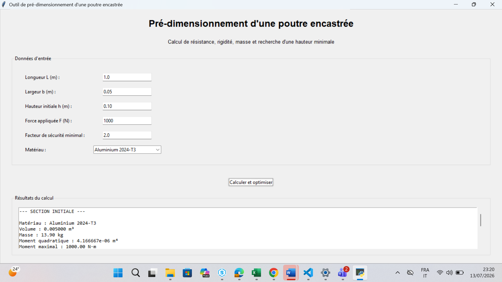

# Outil Python de pré-dimensionnement d’une poutre encastrée

## Présentation

Ce projet consiste à développer une application Python permettant de vérifier et de pré-dimensionner une poutre encastrée de section rectangulaire soumise à une force ponctuelle à son extrémité libre.

L’application calcule les principales grandeurs mécaniques, vérifie les critères de résistance et de rigidité, puis recherche automatiquement une hauteur minimale conforme aux critères imposés.

Une interface graphique réalisée avec Tkinter permet de saisir les données et d’afficher les résultats.
## Aperçu de l’application



## Auteur

**Mohamed Alae Mountassir**

Élève-ingénieur en Aerospace Engineering à l’Université Internationale de Rabat, admis au double diplôme UIR – IMT Mines Albi.

## Fonctionnalités

- Saisie de la géométrie de la poutre
- Saisie de la force appliquée
- Choix du matériau
- Saisie d’un facteur de sécurité minimal
- Calcul du moment quadratique
- Calcul du moment fléchissant maximal
- Calcul de la contrainte maximale de flexion
- Calcul de la flèche maximale
- Calcul de la flèche admissible
- Calcul du facteur de sécurité
- Vérification du critère de résistance
- Vérification du critère de rigidité
- Calcul du volume et de la masse
- Comparaison entre l’aluminium et l’acier
- Recherche automatique d’une hauteur minimale
- Comparaison entre la section initiale et la section optimisée
- Interface graphique réalisée avec Tkinter
- Affichage des résultats dans une interface graphique avec barre de défilement
- Fonctions de génération de diagrammes mécaniques présentes dans le code
- Fonctions d’export CSV et PNG présentes dans le code, mais non reliées aux boutons de l’interface finale

## Matériaux disponibles

### Aluminium 2024-T3

Valeurs pédagogiques utilisées dans l’application :

- Module d’Young : 73,1 GPa
- Limite élastique : 320 MPa
- Masse volumique : 2 780 kg/m³

### Acier de construction

Valeurs pédagogiques utilisées dans l’application :

- Module d’Young : 210 GPa
- Limite élastique : 235 MPa
- Masse volumique : 7 850 kg/m³

Les propriétés utilisées devront être vérifiées et associées à des références techniques précises avant toute utilisation dans un projet industriel.

## Modèle mécanique

Le projet étudie une poutre :

- encastrée à une extrémité ;
- libre à l’autre extrémité ;
- soumise à une force ponctuelle verticale en bout ;
- de section rectangulaire constante.

### Moment quadratique

Pour une section rectangulaire :

I = b × h³ / 12

### Moment fléchissant maximal

Mmax = F × L

### Contrainte maximale de flexion

σmax = Mmax × (h / 2) / I

### Flèche maximale

fmax = F × L³ / (3 × E × I)

### Facteur de sécurité

FS = Re / σmax

## Critères de validation

La section est considérée comme acceptable lorsque les deux conditions suivantes sont respectées :

1. Le facteur de sécurité calculé est supérieur ou égal au facteur minimal demandé.
2. La flèche maximale est inférieure ou égale à la flèche admissible.

Le critère de flèche utilisé dans le projet est :

fadm = L / 250

Ce critère constitue un choix pédagogique et doit être adapté au cahier des charges du système étudié.

## Recherche automatique de la hauteur

L’algorithme teste différentes hauteurs de section entre 10 mm et 200 mm avec un pas de 1 mm.

La première hauteur respectant simultanément le critère de résistance et le critère de rigidité est retenue.

La largeur, la longueur, la force et le matériau restent constants pendant cette recherche.

## Hypothèses

- Comportement élastique linéaire
- Matériau homogène et isotrope
- Petites déformations
- Section rectangulaire constante
- Force ponctuelle appliquée à l’extrémité libre
- Encastrement supposé parfait
- Analyse statique
- Poids propre négligé dans le calcul mécanique
- Absence de défauts géométriques et de concentrations locales de contraintes

## Limites

Le programme ne prend pas actuellement en compte :

- la fatigue ;
- les vibrations ;
- le flambement ;
- les contacts ;
- les assemblages ;
- les concentrations de contraintes ;
- les déformations plastiques ;
- les chargements répartis ;
- le poids propre ;
- les variations de section ;
- les dimensions commerciales disponibles ;
- les coûts de fabrication ;
- les normes de dimensionnement.

Cet outil constitue un pré-dimensionnement analytique à finalité pédagogique. Les résultats ne remplacent pas une étude complète de conception, une validation expérimentale, une simulation par éléments finis ou une justification réglementaire.

## Technologies utilisées

- Python
- NumPy
- Matplotlib
- Tkinter
- CSV

## Validation fonctionnelle

L’application a été vérifiée avec plusieurs cas de test.

### Test 1 — Aluminium 2024-T3

Données :

- Longueur : 1 m
- Largeur : 0,05 m
- Hauteur initiale : 0,10 m
- Force : 1 000 N
- Facteur de sécurité minimal : 2

Résultats approximatifs :

- Masse initiale : 13,90 kg
- Contrainte maximale : 12,00 MPa
- Flèche maximale : 1,094 mm
- Facteur de sécurité : 26,67
- Hauteur minimale proposée : 65 mm
- Masse optimisée : 9,03 kg

### Test 2 — Acier de construction

Avec la même géométrie et le même chargement :

- Masse initiale : 39,25 kg
- Contrainte maximale : 12,00 MPa
- Flèche maximale : 0,381 mm
- Facteur de sécurité : 19,58
- Hauteur minimale proposée : 46 mm
- Masse optimisée : 18,05 kg

### Test 3 — Gestion des erreurs

Les comportements suivants ont été vérifiés :

- une saisie non numérique déclenche un message d’erreur ;
- une valeur nulle ou négative est refusée ;
- un facteur de sécurité minimal non positif est refusé ;
- l’absence de solution entre 10 mm et 200 mm est signalée.

Les résultats de référence ont été vérifiés analytiquement dans le cadre des hypothèses définies. Une comparaison avec ANSYS Mechanical reste recommandée pour compléter la validation numérique.
## Validation numérique sous ANSYS Mechanical

Une validation du modèle analytique a été réalisée à l’aide d’une analyse par éléments finis sous ANSYS Mechanical.

### Cas étudié

- Longueur : 1000 mm
- Largeur : 50 mm
- Hauteur : 100 mm
- Force appliquée : 1000 N
- Matériau : Aluminium 2024-T3

### Résultats principaux

| Grandeur | Python | ANSYS |
|-----------|---------|---------|
| Flèche maximale | 1,0944 mm | 1,0959 mm |
| Contrainte | 12,00 MPa | 12,525 MPa |
| Facteur de sécurité | 26,67 | 25,55 |

### Conclusion

L'écart relatif sur la flèche est d'environ 0,14 %, ce qui valide la cohérence du modèle analytique développé en Python.

Les détails de l'étude ANSYS sont disponibles dans le dossier :

validation_ansys/
``
## Améliorations possibles

- Comparaison avec une simulation ANSYS Mechanical
- Ajout d’un chargement réparti
- Ajout d’autres géométries de section
- Prise en compte du poids propre
- Ajout de critères de fatigue
- Utilisation de dimensions commerciales
- Création d’un rapport automatique
- Ajout de tests unitaires
- Relier l’export CSV à un bouton de l’interface
- Relier l’affichage et l’enregistrement des graphiques à un bouton de l’interface

## Installation

Installer les bibliothèques nécessaires :

```bash
pip install numpy matplotlib
