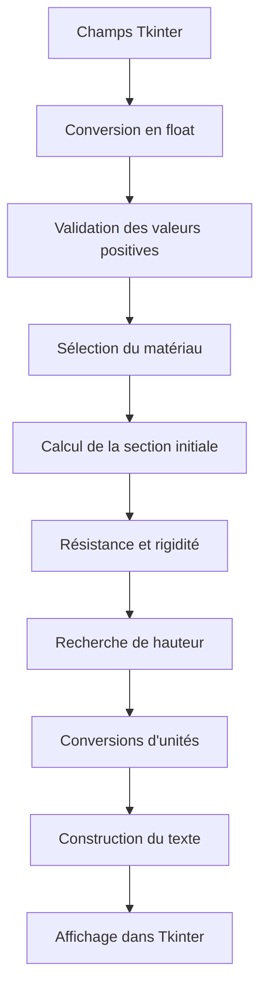
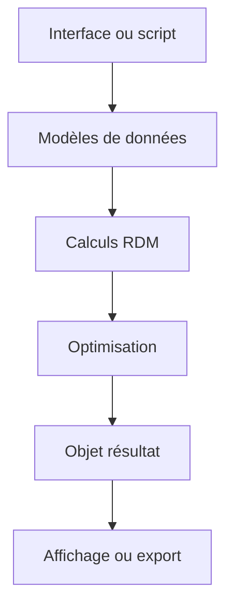

# Architecture initiale du projet

## Point d'entrée

Lorsque le fichier est exécuté directement, le programme appelle
`lancer_interface()`.

La fonction `main()` correspondant à l'ancienne utilisation en console
est encore présente, mais son appel est commenté.

## Organisation du fichier initial

Le projet est principalement contenu dans `projet_poutre_v10.py`.

| Zone approximative | Responsabilité |
|---|---|
| Lignes 9 à 44 | Formules RDM et vérifications |
| Lignes 45 à 115 | Recherche de la hauteur minimale |
| Lignes 116 à 143 | Sélection du matériau |
| Lignes 144 à 218 | Positions, efforts et graphiques |
| Lignes 219 à 357 | Export CSV |
| Lignes 358 à 695 | Ancien fonctionnement en console |
| À partir de la ligne 696 | Interface graphique Tkinter |
| Lignes 915 à 1070 | Calcul déclenché par l'interface |

## Trajet actuel des données



## Entrées

L'interface fournit :

- longueur L en mètres ;
- largeur b en mètres ;
- hauteur initiale h en mètres ;
- force F en newtons ;
- facteur de sécurité minimal ;
- nom du matériau.

Les données de l'interface sont initialement des chaînes de caractères.
Elles sont converties en nombres flottants dans `calculer_interface()`.

## Validation actuelle

Le programme vérifie que les cinq valeurs numériques sont strictement
positives.

Une erreur de conversion déclenche une boîte de dialogue.

Limites de cette validation :

- absence de contrôle explicite de `nan` et `inf` ;
- absence de bornes physiques raisonnables ;
- absence d'erreurs détaillées par champ ;
- choix du matériau étroitement lié au texte de l'interface.

## Calcul initial

Après la validation, le programme calcule :

- volume ;
- masse ;
- moment quadratique ;
- moment maximal ;
- contrainte maximale ;
- flèche maximale ;
- flèche admissible ;
- facteur de sécurité ;
- conformité en résistance ;
- conformité en rigidité.

## Optimisation

La fonction `rechercher_hauteur_minimale()` reçoit les données du
problème et retourne un tuple contenant :

1. hauteur optimisée ;
2. contrainte optimisée ;
3. flèche optimisée ;
4. facteur de sécurité optimisé ;
5. masse optimisée.

L'ordre de ce tuple doit être connu par le code appelant.

## Présentation des résultats

`calculer_interface()` convertit les contraintes en MPa et les flèches
en millimètres.

Il construit ensuite une grande chaîne de caractères contenant les
résultats initiaux et optimisés. Cette chaîne est directement insérée
dans le composant texte de Tkinter.

## Problèmes d'architecture identifiés

- fichier principal de plus de 1 000 lignes ;
- responsabilités multiples dans `calculer_interface()` ;
- duplication entre l'ancien mode console et l'interface ;
- propriétés des matériaux codées directement dans une fonction ;
- unités implicites ;
- résultats retournés sous forme de tuples ;
- calculs, formatage et interface fortement couplés ;
- limites d'optimisation écrites directement dans le code ;
- logique difficile à vérifier indépendamment de l'interface.

## Architecture cible



La reconstruction utilisera progressivement la structure suivante :

```text
src/
└── poutre/
    ├── modeles.py
    ├── materiaux.py
    ├── calculs.py
    ├── optimisation.py
    ├── interface.py
    └── export.py

tests/
├── test_calculs.py
└── test_optimisation.py
```

### Responsabilités prévues

- `modeles.py` : entrées et résultats structurés ;
- `materiaux.py` : propriétés documentées des matériaux ;
- `calculs.py` : formules mécaniques indépendantes ;
- `optimisation.py` : recherche de la section admissible ;
- `interface.py` : saisie et présentation uniquement ;
- `export.py` : génération des fichiers de résultats ;
- `tests/` : vérifications automatiques du programme.

## Règle de reconstruction

La nouvelle architecture devra reproduire le cas de référence avant
toute modification fonctionnelle :

- hauteur optimisée : 65,0 mm ;
- contrainte optimisée : 28,40 MPa ;
- flèche optimisée : 3,985 mm ;
- masse optimisée : 9,03 kg ;
- facteur de sécurité optimisé : 11,27.