# Rapport de validation analytique et numérique

## Outil de pré-dimensionnement d’une poutre encastrée

**Auteur :** Mohamed Alae Mountassir  
**Méthodes :** Python, résistance des matériaux, CATIA V5 et ANSYS Mechanical

## 1. Résumé

Ce rapport présente la validation analytique et numérique d’un outil Python de pré-dimensionnement d’une poutre encastrée à section rectangulaire. L’application calcule la contrainte maximale de flexion, la flèche, la masse et le facteur de sécurité, puis recherche une hauteur minimale respectant simultanément les critères de résistance et de rigidité.

Le cas de référence concerne une poutre en Aluminium 2024-T3 de longueur 1000 mm, de largeur 50 mm et de hauteur initiale 100 mm, encastrée à une extrémité et soumise à une force verticale de 1000 N à son extrémité libre. Les résultats analytiques de l’outil Python sont comparés à ceux d’un modèle éléments finis reconstruit indépendamment avec CATIA V5 et ANSYS Mechanical.

La validation comprend la vérification des réactions à l’encastrement, de la déformation directionnelle, de la contrainte normale de flexion et de la convergence du maillage. La contrainte équivalente de von Mises est également examinée, avec une attention particulière portée à la concentration de contraintes située au voisinage de l’encastrement.

Cette démarche permet d’évaluer la cohérence physique du programme, de quantifier les écarts entre les modèles analytique et numérique et de préciser le domaine de validité de l’outil.

## 2. Objectifs de la validation

L’objectif principal est de vérifier que les résultats produits par l’outil Python sont cohérents avec les équations analytiques de résistance des matériaux et avec une simulation indépendante par éléments finis.

La validation doit permettre de :

- vérifier les dimensions, les unités et les propriétés du matériau utilisées dans le programme ;
- confirmer le calcul du moment quadratique de la section rectangulaire ;
- comparer la flèche maximale calculée par Python avec la déformation obtenue sous ANSYS ;
- comparer la contrainte normale de flexion avec la contrainte normale suivant l’axe longitudinal de la poutre ;
- vérifier l’équilibre global à partir de la force et du moment de réaction à l’encastrement ;
- étudier l’influence de la taille du maillage sur les résultats numériques ;
- identifier et expliquer les concentrations de contraintes au voisinage de l’encastrement ;
- déterminer le domaine de validité et les limites du modèle analytique employé.

La géométrie est réalisée sous CATIA V5, puis importée dans ANSYS Mechanical. Le modèle numérique est reconstruit à partir des données physiques de référence afin de rendre la comparaison indépendante du code Python.

## 3. Modèle analytique de référence

### 3.1 Données du cas étudié

Le cas de référence est une poutre droite, pleine, de section rectangulaire constante, encastrée à une extrémité et soumise à une force verticale à son extrémité libre.

| Paramètre | Symbole | Valeur |
|---|---:|---:|
| Longueur | \(L\) | 1,000 m |
| Largeur | \(b\) | 0,050 m |
| Hauteur | \(h\) | 0,100 m |
| Force appliquée | \(F\) | 1000 N |
| Module de Young | \(E\) | 73,1 GPa |
| Limite élastique | \(R_e\) | 320 MPa |
| Masse volumique | \(\rho\) | 2780 kg/m³ |
| Flèche admissible | \(\delta_{\mathrm{adm}}\) | \(L/250 = 4,000\) mm |
| Facteur de sécurité minimal | \(FS_{\min}\) | 2,00 |

Le matériau retenu est l’Aluminium 2024-T3.

### 3.2 Hypothèses du modèle analytique

Le calcul repose sur les hypothèses suivantes :

- matériau homogène, isotrope et linéaire élastique ;
- petites déformations et petits déplacements ;
- poutre droite de section rectangulaire constante ;
- encastrement considéré comme parfaitement rigide ;
- charge statique ponctuelle appliquée à l’extrémité libre ;
- comportement décrit par la théorie d’Euler-Bernoulli ;
- déformation due au cisaillement négligée ;
- absence de torsion, de charge axiale et de plasticité ;
- poids propre non pris en compte.

### 3.3 Moment quadratique de la section

Pour une section rectangulaire de largeur \(b\) et de hauteur \(h\), le moment quadratique associé à la flexion étudiée est :

$$
I = \frac{b h^3}{12}
$$

Application numérique :

$$
I = \frac{0{,}050 \times 0{,}100^3}{12}
  = 4{,}166667 \times 10^{-6}\ \mathrm{m^4}
$$

### 3.4 Moment fléchissant maximal

Pour une poutre encastrée soumise à une force ponctuelle à son extrémité libre :

$$
M_{\max} = F L
$$

Ainsi :

$$
M_{\max} = 1000 \times 1{,}000
         = 1000\ \mathrm{N\,m}
$$

Le moment maximal est situé au niveau de l’encastrement.

### 3.5 Contrainte normale maximale de flexion

La contrainte normale maximale est calculée sur la fibre la plus éloignée de l’axe neutre :

$$
\sigma_{\max} = \frac{M_{\max}(h/2)}{I}
$$

Application numérique :

$$
\sigma_{\max}
= \frac{1000 \times 0{,}050}
       {4{,}166667 \times 10^{-6}}
= 12{,}00\ \mathrm{MPa}
$$

### 3.6 Flèche maximale

Selon la théorie d’Euler-Bernoulli, la flèche maximale à l’extrémité libre est :

$$
\delta_{\max} = \frac{F L^3}{3 E I}
$$

Application numérique :

$$
\delta_{\max}
= \frac{1000 \times 1{,}000^3}
       {3 \times 73{,}1 \times 10^9
       \times 4{,}166667 \times 10^{-6}}
= 1{,}094\ \mathrm{mm}
$$

La flèche obtenue est inférieure à la flèche admissible :

$$
1{,}094\ \mathrm{mm} < 4{,}000\ \mathrm{mm}
$$

### 3.7 Masse et facteur de sécurité

Le volume et la masse de la poutre sont :

$$
V = L b h = 0{,}005000\ \mathrm{m^3}
$$

$$
m = \rho V = 2780 \times 0{,}005000
  = 13{,}90\ \mathrm{kg}
$$

Le facteur de sécurité par rapport à la limite élastique est :

$$
FS = \frac{R_e}{\sigma_{\max}}
   = \frac{320}{12{,}00}
   = 26{,}67
$$

Le facteur obtenu est supérieur au facteur minimal demandé :

$$
26{,}67 > 2{,}00
$$

La section initiale respecte donc les critères de résistance et de rigidité. Pour ce cas, la rigidité constitue le critère dimensionnant de l’optimisation.

## 4. Reconstruction du modèle sous ANSYS

### 4.1 Géométrie réalisée sous CATIA V5

La géométrie a été reconstruite sous CATIA V5 sous la forme d’un unique solide parallélépipédique. Les dimensions utilisées sont identiques à celles du modèle analytique :

- longueur suivant l’axe global \(X\) : 1000 mm ;
- largeur suivant l’axe global \(Y\) : 50 mm ;
- hauteur suivant l’axe global \(Z\) : 100 mm.

Le solide a ensuite été importé dans ANSYS Workbench. Après importation, les dimensions, le volume et la masse ont été vérifiés dans ANSYS Mechanical :

- volume : \(5{,}0 \times 10^6\ \mathrm{mm^3}\) ;
- masse : 13,90 kg ;
- centre de gravité : \(X=500\) mm, \(Y=25\) mm et \(Z=50\) mm.

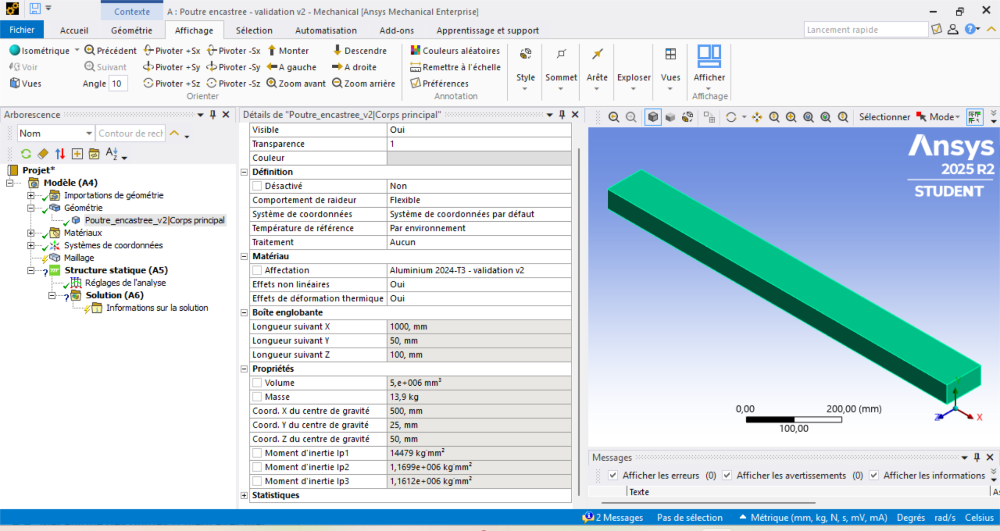

### 4.2 Matériau

Un matériau personnalisé nommé `Aluminium 2024-T3 - validation v2` a été créé dans les données techniques d’ANSYS avec les propriétés suivantes :

| Propriété | Valeur |
|---|---:|
| Module de Young | 73 100 MPa |
| Coefficient de Poisson | 0,33 |
| Masse volumique | 2780 kg/m³ |
| Limite élastique en traction | 320 MPa |

Le comportement retenu est isotrope et linéaire élastique. La limite élastique est utilisée uniquement pour l’interprétation du facteur de sécurité ; aucun comportement plastique n’est introduit dans la simulation.

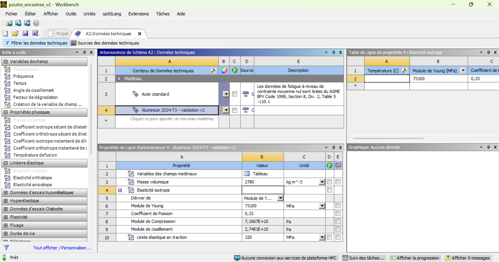

### 4.3 Type d’analyse

Une analyse de structure statique linéaire a été utilisée. Les principaux réglages sont :

- une seule étape de chargement ;
- temps pseudo-statique final : 1 s ;
- solveur contrôlé par le programme ;
- grands déplacements désactivés ;
- ressorts de faible raideur désactivés ;
- effets dynamiques désactivés ;
- poids propre non appliqué ;
- température de référence : 22 °C.

Ces choix permettent de conserver des hypothèses cohérentes avec le modèle analytique d’Euler-Bernoulli, fondé sur les petites déformations et un comportement linéaire élastique.

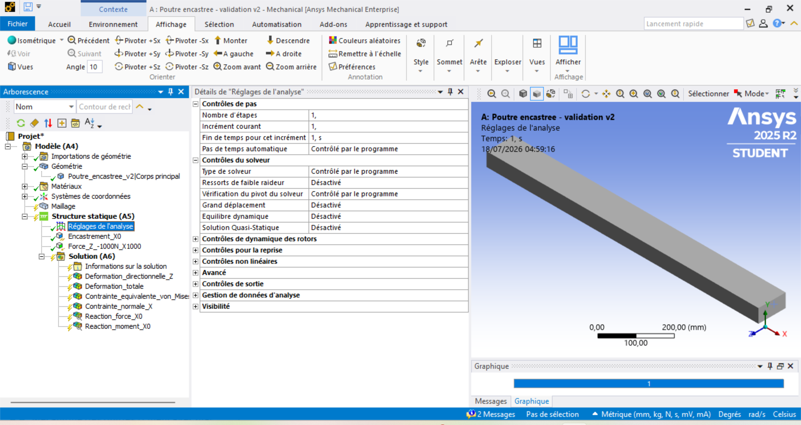

### 4.4 Conditions aux limites

La face située à \(X=0\) est soumise à un support fixe. Pour le modèle solide tridimensionnel, les trois composantes de déplacement de cette face sont bloquées.

Une force totale de 1000 N est appliquée sur la face opposée située à \(X=1000\) mm. Elle est orientée suivant la direction globale négative \(Z\) :

$$
F_X = 0,\qquad F_Y = 0,\qquad F_Z = -1000\ \mathrm{N}
$$

Dans ANSYS, cette force totale est répartie sur la face d’extrémité. Elle est globalement équivalente à la force ponctuelle du modèle analytique lorsque sa résultante passe par le centre de la section. Le moment théorique produit à l’encastrement reste donc :

$$
M_Y = F L = 1{,}0 \times 10^6\ \mathrm{N\,mm}
$$

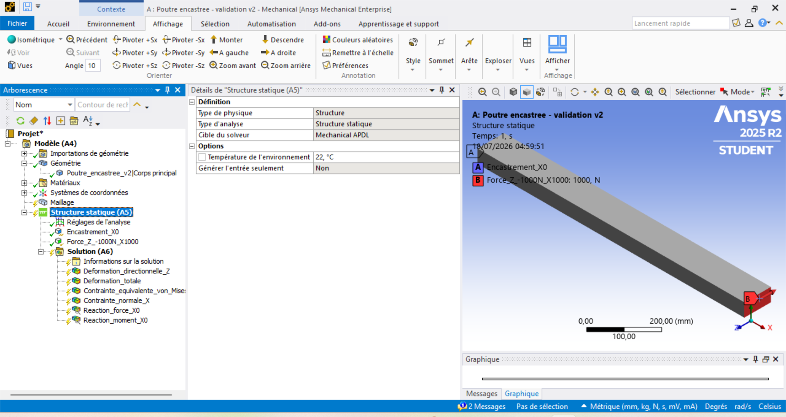

### 4.5 Résultats demandés

Les résultats suivants ont été ajoutés avant la résolution :

- déformation directionnelle suivant l’axe global \(Z\) ;
- déformation totale ;
- contrainte normale suivant l’axe longitudinal \(X\) ;
- contrainte équivalente de von Mises ;
- force de réaction au niveau de l’encastrement ;
- moment de réaction au niveau de l’encastrement.

La déformation directionnelle suivant \(Z\) est utilisée pour la comparaison principale avec la flèche analytique. La contrainte normale suivant \(X\) est utilisée pour la comparaison avec la contrainte de flexion calculée par la résistance des matériaux.

La contrainte équivalente de von Mises est conservée comme indicateur complémentaire. Sa valeur maximale au bord de l’encastrement doit être interprétée avec prudence, car elle peut être influencée par la condition de support fixe et par la taille du maillage.

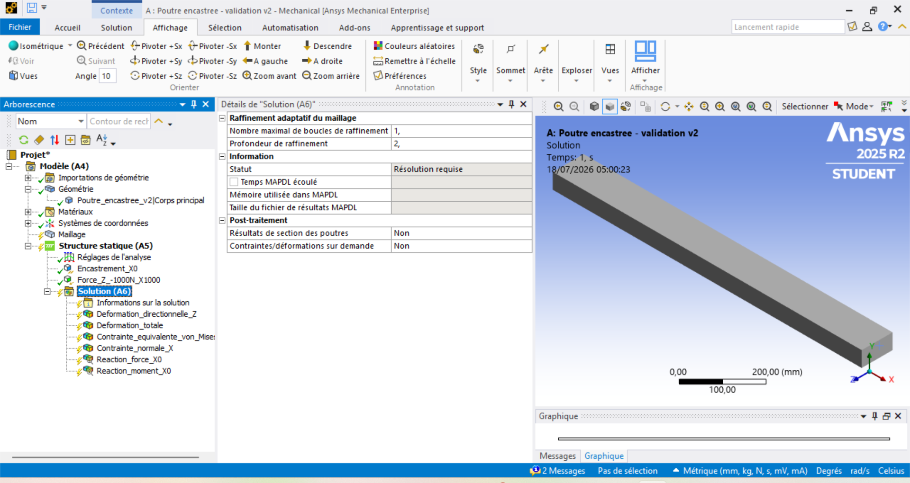

## 5. Étude de convergence du maillage

### 5.1 Méthode

Une étude de convergence a été réalisée afin de vérifier que les résultats numériques ne dépendent plus significativement de la taille des éléments.

Trois maillages structurés à éléments quadratiques ont été comparés :

- taille d’élément de 50 mm ;
- taille d’élément de 25 mm ;
- taille d’élément de 12,5 mm.

La géométrie, le matériau, les conditions aux limites, le chargement et les réglages de l’analyse sont identiques pour les trois calculs. Seule la taille du maillage est modifiée.

### 5.2 Caractéristiques des maillages

| Taille d’élément | Nombre de nœuds | Nombre d’éléments | Type d’éléments |
|---:|---:|---:|---|
| 50 mm | 393 | 40 | Quadratiques structurés |
| 25 mm | 2 117 | 320 | Quadratiques structurés |
| 12,5 mm | 13 401 | 2 560 | Quadratiques structurés |

Lorsque la taille des éléments est divisée par deux, le nombre d’éléments est multiplié par huit. Cette évolution est cohérente avec le raffinement d’un modèle solide tridimensionnel.

#### Maillage de 50 mm

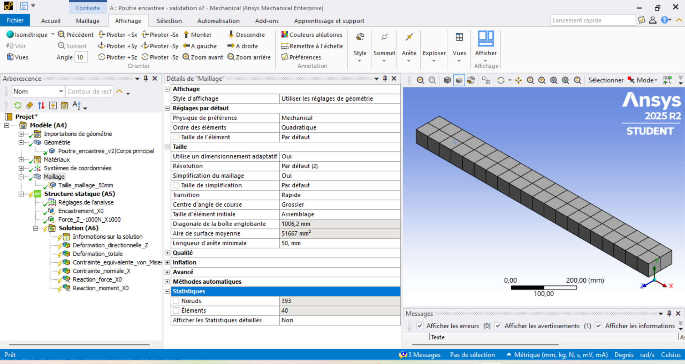

#### Maillage de 25 mm

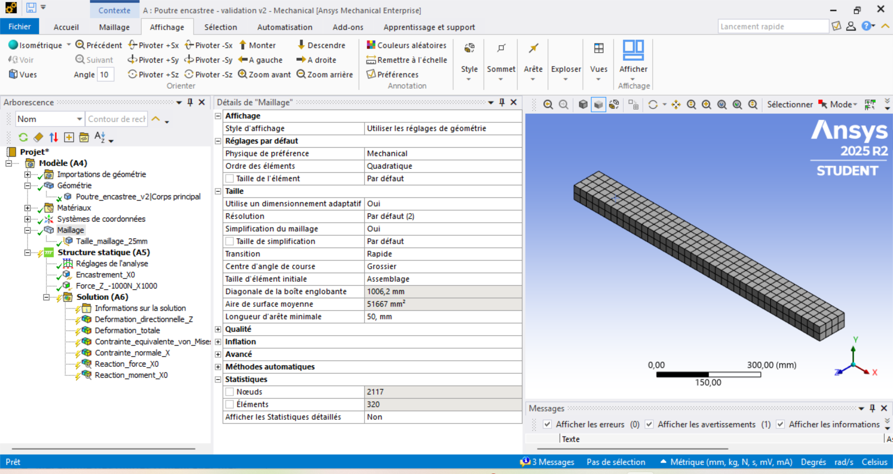

#### Maillage de 12,5 mm

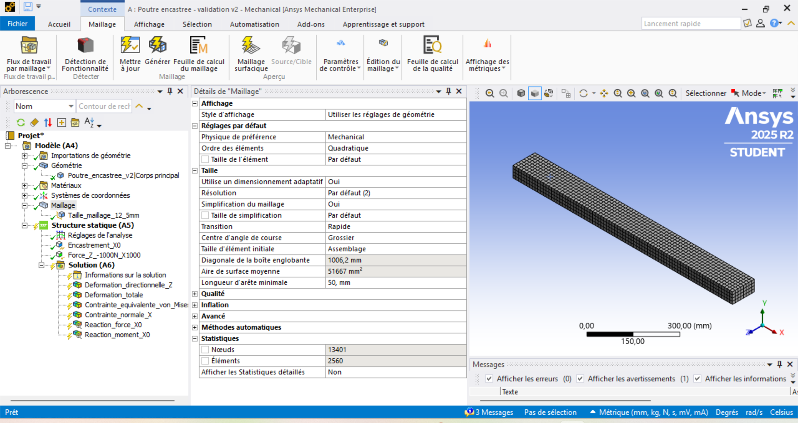

### 5.3 Convergence du déplacement

La grandeur principale utilisée pour la validation de la rigidité est la valeur absolue du déplacement directionnel suivant l’axe global $Z$.

La déformation totale affichée par ANSYS correspond à la norme des composantes du déplacement. Elle est légèrement supérieure au déplacement directionnel suivant $Z$ en raison de faibles déplacements secondaires suivant les autres axes.

| Taille du maillage | Déplacement $Z$ maximal | Écart absolu avec l’analytique | Écart relatif | Déformation totale maximale |
|---:|---:|---:|---:|---:|
| 50 mm | 1,0941 mm | 0,0003 mm | 0,027 % | 1,0971 mm |
| 25 mm | 1,0959 mm | 0,0015 mm | 0,137 % | 1,0990 mm |
| 12,5 mm | 1,0968 mm | 0,0024 mm | 0,219 % | 1,0998 mm |

La variation entre deux raffinements successifs est :

| Passage de maillage | Variation absolue du déplacement $Z$ | Variation relative |
|---|---:|---:|
| 50 mm vers 25 mm | 0,0018 mm | 0,164 % |
| 25 mm vers 12,5 mm | 0,0009 mm | 0,082 % |

La variation entre les deux derniers maillages est inférieure à 0,1 %. Le déplacement peut donc être considéré comme convergé vers une valeur proche de 1,097 mm.

Le raffinement ne doit pas nécessairement faire converger le modèle tridimensionnel exactement vers la solution d’Euler-Bernoulli. Il fait converger la solution vers celle du modèle solide ANSYS. L’écart final avec la valeur analytique de 1,0944 mm reste néanmoins inférieur à 0,23 %.

Cet écart réduit peut être expliqué par :

- la représentation tridimensionnelle de la poutre ;
- les effets locaux de l’encastrement ;
- la prise en compte des faibles déplacements transversaux ;
- l’application de la force totale sur une face ;
- les hypothèses simplificatrices de la théorie d’Euler-Bernoulli.

### 5.4 Sensibilité des contraintes locales

Les contraintes maximales relevées au voisinage de l’encastrement sont :

| Taille du maillage | Contrainte normale $X$ maximale | Contrainte équivalente de von Mises maximale |
|---:|---:|---:|
| 50 mm | 12,361 MPa | 12,238 MPa |
| 25 mm | 14,515 MPa | 12,525 MPa |
| 12,5 mm | 17,553 MPa | 14,651 MPa |

Contrairement au déplacement, les contraintes maximales locales augmentent lorsque le maillage est raffiné. Ces maxima apparaissent au voisinage immédiat des arêtes de la face encastrée.

L’encastrement parfait impose une annulation brutale des déplacements sur toute la face. À l’intersection entre cette face et les faces libres, cette condition produit une forte concentration de contrainte pouvant présenter un caractère singulier.

Par conséquent, le maximum nodal relevé exactement sur une arête encastrée :

- dépend fortement de la taille des éléments ;
- ne représente pas directement la contrainte nominale de flexion ;
- ne doit pas être utilisé seul pour valider la valeur analytique de 12 MPa ;
- doit être distingué du comportement global de la poutre.

Une comparaison plus représentative de la contrainte nécessite une extraction sur une section légèrement éloignée de l’encastrement, le long d’un chemin ou sur une zone moyennée.

### 5.5 Vérification de l’équilibre

| Taille du maillage | Réaction suivant $Z$ | Moment principal autour de $Y$ |
|---:|---:|---:|
| 50 mm | 1 000 N | -1 000 000 N·mm |
| 25 mm | 1 000 N | -1 000 000 N·mm |
| 12,5 mm | 1 000 N | -1 000 000 N·mm |
| Valeur analytique en module | 1 000 N | 1 000 000 N·mm |

Les réactions sont indépendantes du maillage et correspondent exactement aux valeurs analytiques en valeur absolue.

Le signe négatif du moment autour de $Y$ provient de la convention d’orientation du système de coordonnées global d’ANSYS. Il ne constitue pas un écart physique.

Ces résultats confirment :

- l’équilibre global des forces ;
- l’équilibre global des moments ;
- la bonne orientation du chargement ;
- la bonne sélection des faces d’application ;
- la bonne définition de l’encastrement.

### 5.6 Maillage retenu

Le maillage de 25 mm est retenu comme maillage de référence pour l’exploitation courante des résultats.

Ce choix constitue un compromis entre précision et coût numérique :

- l’écart de déplacement avec le maillage de 12,5 mm est seulement de 0,082 % ;
- le déplacement global est déjà convergé ;
- le maillage de 25 mm comporte 320 éléments ;
- le maillage de 12,5 mm comporte 2 560 éléments ;
- le maillage fin exige donc un coût numérique nettement supérieur pour une variation très faible du déplacement.

Le maillage de 12,5 mm est conservé comme vérification finale de convergence et pour l’observation qualitative des champs locaux. L’étude valide ainsi le modèle ANSYS pour l’analyse de la rigidité et du comportement global de la poutre.

## 6. Comparaison des résultats

### 6.1 Méthode de comparaison

Le maillage de 25 mm est retenu comme configuration numérique de référence.

Les comparaisons sont réalisées en utilisant :

- la valeur absolue du déplacement directionnel suivant l’axe $Z$ ;
- la valeur absolue de la force de réaction suivant $Z$ ;
- la valeur absolue du moment de réaction autour de $Y$ ;
- les contraintes maximales calculées par ANSYS.

Les signes des réactions dépendent de la convention d’orientation du système de coordonnées. La comparaison des réactions est donc effectuée en valeur absolue.

### 6.2 Comparaison des grandeurs globales

| Grandeur | Résultat analytique | Résultat ANSYS — maillage 25 mm | Écart absolu | Écart relatif |
|---|---:|---:|---:|---:|
| Volume | 0,005000 m³ | 0,005000 m³ | 0 m³ | 0 % |
| Masse | 13,900 kg | 13,900 kg | 0 kg | 0 % |
| Déplacement maximal suivant $Z$ | 1,0944 mm | 1,0959 mm | 0,0015 mm | 0,137 % |
| Force de réaction suivant $Z$, en valeur absolue | 1 000 N | 1 000 N | 0 N | 0 % |
| Moment de réaction autour de $Y$, en valeur absolue | 1 000 000 N·mm | 1 000 000 N·mm | 0 N·mm | 0 % |

L’accord entre le calcul analytique et le modèle ANSYS est excellent pour les grandeurs globales.

La différence de déplacement est seulement de 0,0015 mm, soit 0,137 % de la valeur analytique.

La force et le moment de réaction obtenus dans ANSYS correspondent exactement aux valeurs imposées par l’équilibre statique :

$$
\left|R_Z\right| = F = 1\,000\ \mathrm{N}
$$

$$
\left|M_Y\right| = F L
= 1\,000 \times 1\,000
= 1\,000\,000\ \mathrm{N\,mm}
$$

Ces résultats valident :

- les dimensions de la géométrie importée depuis CATIA V5 ;
- les unités utilisées dans ANSYS ;
- la direction et l’intensité du chargement ;
- la position de l’encastrement ;
- les propriétés élastiques du matériau ;
- le calcul analytique de la flèche ;
- l’équilibre statique du modèle numérique.

### 6.3 Comparaison des déplacements

Le calcul analytique prévoit une flèche maximale à l’extrémité libre de :

$$
\delta_{\max,\mathrm{analytique}} = 1,0944\ \mathrm{mm}
$$

Le modèle ANSYS avec un maillage de 25 mm donne :

$$
\left|U_{Z,\max,\mathrm{ANSYS}}\right| = 1,0959\ \mathrm{mm}
$$

L’écart absolu vaut :

$$
\Delta \delta
=
\left|
1,0959 - 1,0944
\right|
=
0,0015\ \mathrm{mm}
$$

L’écart relatif vaut :

$$
\varepsilon_{\delta}
=
\frac{0,0015}{1,0944}\times 100
=
0,137\ \%
$$

Cet écart est très faible. Il confirme que le modèle Python reproduit correctement le comportement global en flexion de la poutre.

La déformation totale maximale obtenue avec le maillage de 25 mm vaut 1,0990 mm. Elle est légèrement supérieure au déplacement directionnel suivant $Z$, car elle correspond à la norme du vecteur déplacement :

$$
U_{\mathrm{tot}}
=
\sqrt{U_X^2 + U_Y^2 + U_Z^2}
$$

Pour comparer le modèle ANSYS à la formule analytique de flèche, la grandeur pertinente reste donc le déplacement directionnel suivant $Z$.

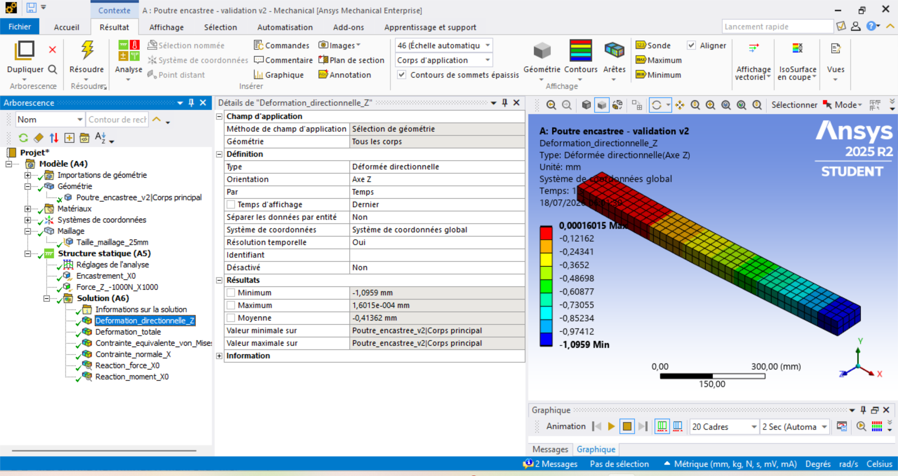

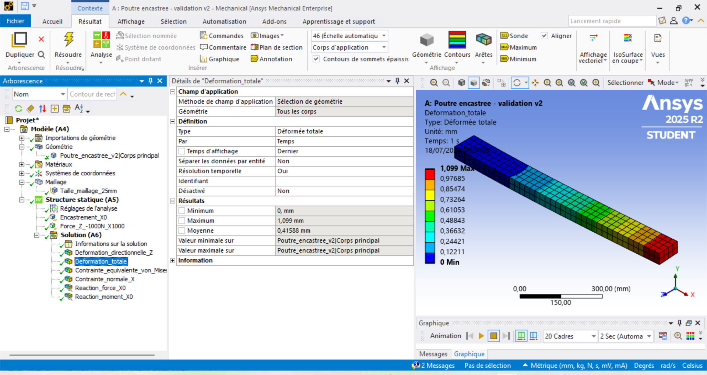

### 6.4 Comparaison des contraintes

La contrainte analytique nominale maximale de flexion vaut :

$$
\sigma_{\max,\mathrm{analytique}} = 12,000\ \mathrm{MPa}
$$

Les maxima obtenus dans ANSYS avec le maillage de 25 mm sont :

| Indicateur | Valeur analytique | Valeur ANSYS — 25 mm | Différence |
|---|---:|---:|---:|
| Contrainte normale suivant $X$ | 12,000 MPa | 14,515 MPa | +2,515 MPa |
| Contrainte équivalente de von Mises | Non utilisée dans le modèle analytique uniaxial | 12,525 MPa | — |

Si le maximum de contrainte normale ANSYS est comparé directement à la contrainte analytique, la différence relative apparente vaut :

$$
\frac{14,515-12,000}{12,000}\times100
=
20,96\ \%
$$

Cette différence ne doit cependant pas être interprétée comme une erreur globale de 20,96 %.

La contrainte analytique de 12 MPa est une contrainte nominale issue de la théorie unidimensionnelle des poutres. Le maximum ANSYS est une valeur locale relevée au voisinage immédiat des arêtes de l’encastrement.

À cet endroit, l’encastrement parfait tridimensionnel produit :

- une interruption brutale des déplacements ;
- une concentration locale des contraintes ;
- une forte sensibilité à la taille du maillage ;
- une possible singularité numérique sur les arêtes de la face encastrée.

Le maximum local augmente donc lorsque le maillage est raffiné, alors que les déplacements et les réactions sont déjà convergés.

La contrainte maximale située exactement sur l’arête de l’encastrement ne constitue pas une grandeur suffisamment robuste pour valider seule la contrainte nominale analytique.

Une comparaison locale plus représentative nécessiterait d’extraire la contrainte normale suivant $X$ :

- sur une section située à une distance définie de l’encastrement ;
- le long d’un chemin dans la direction longitudinale ;
- ou sous forme d’une valeur moyennée sur une zone éloignée des arêtes.

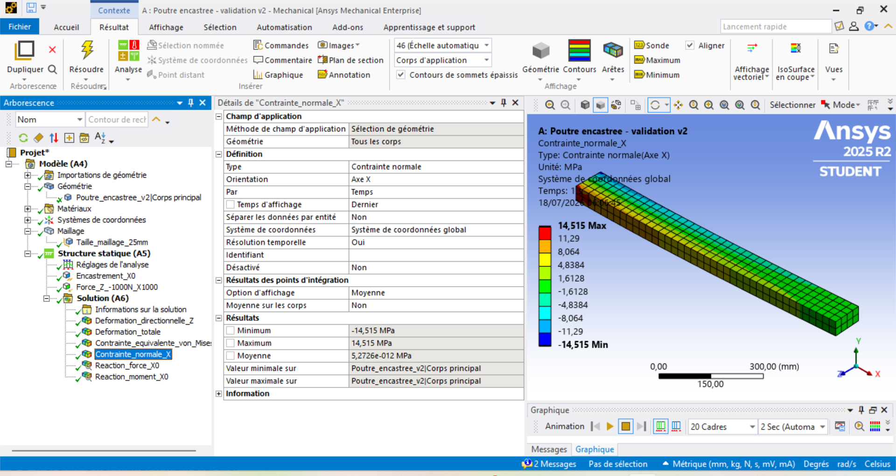

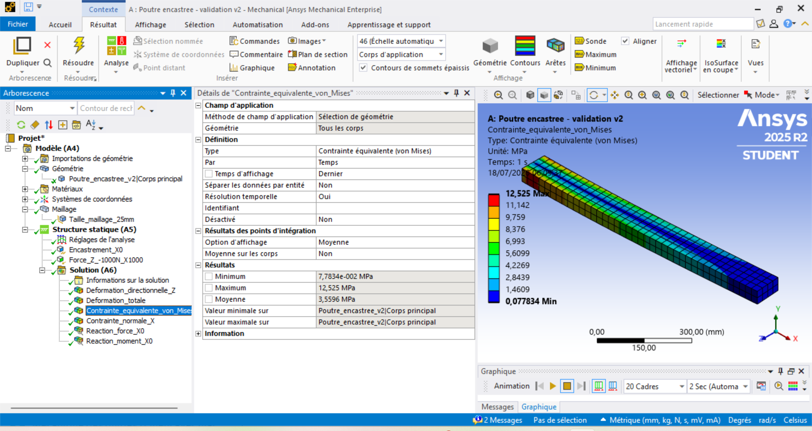

### 6.5 Bilan de la comparaison

La comparaison met en évidence deux comportements différents.

Les grandeurs globales sont parfaitement cohérentes :

- écart de déplacement inférieur à 0,14 % ;
- réaction suivant $Z$ exactement équilibrée ;
- moment de réaction exactement équilibré ;
- volume et masse identiques ;
- convergence du déplacement confirmée.

Les contraintes maximales locales restent sensibles au raffinement du maillage au voisinage de l’encastrement.

Le modèle ANSYS valide donc de manière solide :

- la rigidité globale de la poutre ;
- la flèche calculée par le programme Python ;
- les conditions aux limites ;
- l’équilibre des forces et des moments.

La validation de la contrainte nominale est globalement cohérente, mais son étude locale à proximité immédiate de l’encastrement doit être interprétée avec précaution.

## 7. Analyse des écarts

### 7.1 Écart sur le déplacement

Le déplacement maximal suivant $Z$ obtenu avec le maillage de référence de 25 mm vaut 1,0959 mm, contre 1,0944 mm pour le calcul analytique.

L’écart relatif est :

$$
\varepsilon_{\delta}=0,137\ \%
$$

Cet écart est suffisamment faible pour considérer les deux modèles comme cohérents.

Il s’explique principalement par les différences entre le modèle analytique et le modèle numérique.

### 7.2 Différence de représentation mécanique

Le calcul analytique utilise la théorie d’Euler-Bernoulli. La poutre est représentée par sa ligne moyenne et son comportement est décrit par des grandeurs unidimensionnelles.

Cette théorie suppose notamment que :

- les sections droites restent planes après déformation ;
- les déformations de cisaillement sont négligées ;
- le matériau est homogène, isotrope et linéaire élastique ;
- les déplacements et les rotations restent faibles ;
- la section est constante ;
- la charge est représentée par une force ponctuelle à l’extrémité libre ;
- l’encastrement est idéal.

Le modèle ANSYS utilise au contraire une géométrie tridimensionnelle solide.

Il prend donc en compte automatiquement :

- les déplacements dans les trois directions ;
- les déformations transversales ;
- les effets associés au coefficient de Poisson ;
- les faibles déformations de cisaillement ;
- la distribution tridimensionnelle des contraintes ;
- les effets locaux au voisinage du chargement ;
- les effets locaux au voisinage de l’encastrement.

Ces différences expliquent qu’une égalité absolument parfaite entre les deux déplacements ne soit pas attendue.

### 7.3 Élancement de la poutre

Le rapport entre la longueur et la hauteur de la poutre vaut :

$$
\frac{L}{h}
=
\frac{1\,000}{100}
=
10
$$

La poutre est suffisamment élancée pour que la théorie d’Euler-Bernoulli fournisse une bonne approximation du déplacement global.

Cependant, le rapport $L/h=10$ n’est pas extrêmement élevé. Les effets tridimensionnels et les déformations de cisaillement ne sont donc pas rigoureusement nuls.

Le très faible écart observé avec ANSYS reste cohérent avec cet élancement.

### 7.4 Représentation du chargement

Dans le modèle analytique, la charge est considérée comme une force ponctuelle appliquée à l’extrémité libre.

Dans ANSYS, une force totale de 1 000 N est distribuée sur toute la face libre.

La résultante de cette charge est bien égale à :

$$
F=1\,000\ \mathrm{N}
$$

Son point d’application résultant est situé au centre géométrique de la face. Le chargement global reste donc mécaniquement équivalent au chargement analytique.

La distribution de la force sur une face produit néanmoins un champ de contraintes local différent de celui d’une charge ponctuelle idéale.

Cet effet reste principalement localisé près de la face chargée et influence très peu le déplacement global de la poutre.

### 7.5 Représentation de l’encastrement

Dans le modèle analytique, l’encastrement impose une translation et une rotation nulles à l’origine de la poutre.

Dans le modèle solide ANSYS, le support fixe impose des déplacements nuls sur toute la face située à $X=0$ :

$$
U_X=U_Y=U_Z=0
$$

Le solide tridimensionnel ne possède pas de degrés de liberté de rotation indépendants sur ses nœuds. La rotation de la section est empêchée indirectement par l’annulation des déplacements de tous les nœuds de la face encastrée.

Cette condition reproduit correctement le comportement global d’un encastrement parfait.

Elle crée cependant une transition brutale entre :

- la face totalement immobilisée ;
- le volume voisin qui peut se déformer.

Cette transition explique l’apparition de concentrations de contraintes sur les arêtes de l’encastrement.

### 7.6 Influence du maillage

Le déplacement directionnel suivant $Z$ évolue de la manière suivante :

| Taille du maillage | Déplacement maximal suivant $Z$ |
|---:|---:|
| 50 mm | 1,0941 mm |
| 25 mm | 1,0959 mm |
| 12,5 mm | 1,0968 mm |

La variation entre les deux derniers maillages vaut seulement :

$$
0,082\ \%
$$

Cette faible variation montre que l’erreur de discrétisation sur le déplacement est devenue négligeable pour l’objectif de cette étude.

Les contraintes maximales évoluent différemment :

| Taille du maillage | Contrainte normale $X$ maximale | Contrainte de von Mises maximale |
|---:|---:|---:|
| 50 mm | 12,361 MPa | 12,238 MPa |
| 25 mm | 14,515 MPa | 12,525 MPa |
| 12,5 mm | 17,553 MPa | 14,651 MPa |

Les maxima augmentent avec le raffinement du maillage.

Cette évolution indique que les valeurs maximales sont contrôlées par un phénomène local au voisinage de l’encastrement et non par le comportement global de la poutre.

### 7.7 Contrainte nominale et pic local

La contrainte analytique :

$$
\sigma_{\max}
=
\frac{M_{\max}h}{2I}
=
12,000\ \mathrm{MPa}
$$

correspond à une contrainte normale nominale de flexion.

Elle est issue d’un modèle de poutre et représente la distribution de contrainte sur une section, en dehors des perturbations tridimensionnelles locales.

La contrainte maximale affichée par ANSYS correspond au plus grand résultat calculé dans le modèle solide. Cette valeur peut être située exactement sur une arête de la face encastrée.

Les deux valeurs ne décrivent donc pas rigoureusement la même grandeur physique :

- 12,000 MPa représente une contrainte nominale de flexion ;
- 14,515 MPa représente un maximum local obtenu avec le maillage de 25 mm.

La différence apparente de 20,96 % ne remet donc pas en cause la validation du comportement global.

Pour comparer correctement les contraintes, il faudrait utiliser une extraction située à une distance définie de l’encastrement, où le champ de contrainte n’est plus dominé par les effets de bord.

### 7.8 Contrainte normale et contrainte de von Mises

La formule analytique calcule une contrainte normale longitudinale suivant l’axe de la poutre.

La contrainte équivalente de von Mises est une grandeur scalaire calculée à partir de l’ensemble des composantes du tenseur des contraintes.

Elle sert principalement à évaluer un état de contrainte multiaxial par rapport à la limite élastique d’un matériau ductile.

Dans une zone soumise presque uniquement à une contrainte normale uniaxiale, la contrainte de von Mises est proche de la valeur absolue de la contrainte normale.

Près de l’encastrement, l’état de contrainte devient tridimensionnel. La contrainte normale suivant $X$ et la contrainte équivalente de von Mises ne sont alors plus strictement identiques.

Elles ne doivent donc pas être comparées comme si elles représentaient exactement la même grandeur.

### 7.9 Déplacement directionnel et déformation totale

La formule analytique calcule le déplacement transversal dans la direction de la force.

La grandeur ANSYS directement comparable est donc le déplacement directionnel suivant $Z$.

La déformation totale affichée par ANSYS correspond à la norme du vecteur déplacement :

$$
U_{\mathrm{tot}}
=
\sqrt{U_X^2+U_Y^2+U_Z^2}
$$

Elle est nécessairement positive et peut être légèrement supérieure à la valeur absolue de $U_Z$ lorsque les composantes $U_X$ ou $U_Y$ ne sont pas strictement nulles.

La différence entre 1,0959 mm pour le déplacement suivant $Z$ et 1,0990 mm pour la déformation totale est donc normale.

### 7.10 Convention de signe des réactions

Le modèle analytique donne généralement les valeurs des efforts en module.

Dans ANSYS, les signes dépendent de l’orientation du système de coordonnées global.

La charge appliquée suivant $-Z$ produit une réaction suivant la direction opposée. Le moment de réaction principal est obtenu autour de l’axe $Y$ avec un signe déterminé par la règle de la main droite.

Ainsi, le résultat :

$$
M_Y=-1\,000\,000\ \mathrm{N\,mm}
$$

est cohérent avec la valeur analytique :

$$
\left|M_Y\right|
=
1\,000\,000\ \mathrm{N\,mm}
$$

Le signe négatif ne représente pas une erreur. Il indique uniquement le sens du moment dans le repère global.

### 7.11 Synthèse des sources d’écart

| Source d’écart | Effet principal | Importance observée |
|---|---|---|
| Théorie d’Euler-Bernoulli contre modèle solide 3D | Petite différence de déplacement | Faible |
| Déformation de cisaillement | Augmentation possible de la flèche numérique | Faible |
| Coefficient de Poisson et déformations transversales | Déplacements secondaires | Faible |
| Force répartie sur une face | Perturbation locale près de la face libre | Faible sur le comportement global |
| Encastrement appliqué sur une face complète | Concentration locale de contrainte | Importante localement |
| Taille du maillage | Variation des déplacements et des pics de contrainte | Faible pour le déplacement, importante pour les pics |
| Convention de signe ANSYS | Signe des réactions | Aucun effet sur les valeurs absolues |
| Comparaison entre déplacement directionnel et total | Petite différence entre les valeurs affichées | Normale |

### 7.12 Conclusion de l’analyse des écarts

L’écart de déplacement entre le calcul analytique et ANSYS est très faible et compatible avec les différences de formulation entre les deux modèles.

Les réactions confirment exactement l’équilibre des forces et des moments.

Les écarts les plus importants concernent uniquement les contraintes maximales locales situées près des arêtes de l’encastrement. Ces pics sont sensibles au maillage et ne doivent pas être confondus avec la contrainte nominale de flexion.

La comparaison permet donc de conclure que :

- le modèle Python reproduit correctement la rigidité globale de la poutre ;
- le modèle ANSYS est correctement configuré ;
- les unités et les conditions aux limites sont cohérentes ;
- les résultats de déplacement sont convergés ;
- les contraintes nominales sont physiquement cohérentes ;
- les pics locaux nécessitent une interprétation séparée.

## 8. Limites de la validation

La présente validation démontre la cohérence du programme Python pour le cas de référence étudié. Elle ne constitue cependant pas une validation universelle de l’outil pour toutes les géométries, tous les matériaux et tous les chargements.

### 8.1 Domaine géométrique validé

La validation concerne uniquement une poutre :

- droite et prismatique ;
- pleine ;
- de section rectangulaire constante ;
- sans trou, congé, entaille ou changement de section ;
- encastrée à une extrémité.

Les sections creuses, circulaires, en I, en U ou de forme quelconque n’ont pas été étudiées.

### 8.2 Domaine de chargement validé

Le cas étudié comporte une force statique unique appliquée à l’extrémité libre, perpendiculairement à l’axe longitudinal de la poutre.

La validation ne couvre pas encore :

- les charges réparties ;
- les moments appliqués ;
- les efforts axiaux ;
- la torsion ;
- les chargements combinés ;
- les chargements variables dans le temps ;
- les phénomènes dynamiques ou vibratoires ;
- le flambement.

### 8.3 Hypothèses relatives au matériau

L’Aluminium 2024-T3 est modélisé comme un matériau :

- homogène ;
- isotrope ;
- linéaire élastique ;
- indépendant de la température.

La limite élastique est utilisée uniquement pour calculer un facteur de sécurité indicatif.

Les phénomènes suivants ne sont pas pris en compte :

- plasticité ;
- endommagement ;
- rupture ;
- fatigue ;
- fluage ;
- effets thermiques ;
- anisotropie ;
- dispersion des propriétés du matériau.

### 8.4 Limites du modèle analytique

Le calcul Python repose sur la théorie d’Euler-Bernoulli. Cette théorie suppose notamment :

- de petites déformations ;
- de petites rotations ;
- une section restant plane après déformation ;
- une déformation due au cisaillement négligeable ;
- l’absence d’effets locaux complexes.

Le rapport géométrique du cas étudié vaut :

$$
\frac{L}{h} = \frac{1000}{100} = 10
$$

Le modèle reste adapté à une étude de pré-dimensionnement, mais une théorie incluant le cisaillement, comme celle de Timoshenko, pourrait être plus appropriée pour des poutres plus courtes ou plus épaisses.

### 8.5 Idéalisation des conditions aux limites

Dans ANSYS, l’encastrement est représenté par un support parfaitement fixe appliqué sur toute la face située à $X = 0$.

Dans une structure réelle, la liaison peut présenter :

- une rigidité finie ;
- des jeux ;
- des déformations de l’assemblage ;
- des contacts ;
- des défauts de montage ;
- une répartition non uniforme des efforts.

La force est également répartie sur la face libre dans le modèle tridimensionnel, alors que le modèle analytique la représente comme une force ponctuelle appliquée sur la ligne moyenne de la poutre.

### 8.6 Limites de la validation numérique

La convergence a été étudiée avec trois tailles d’éléments quadratiques structurés :

- 50 mm ;
- 25 mm ;
- 12,5 mm.

Cette étude valide correctement le déplacement global et les réactions d’appui. Elle ne constitue cependant pas une étude exhaustive de toutes les options numériques.

Les éléments suivants n’ont pas été comparés :

- plusieurs types d’éléments ;
- éléments linéaires et quadratiques ;
- différentes méthodes de maillage ;
- différentes formulations du solveur ;
- différentes modélisations de l’encastrement ;
- modèles solides, coques et poutres.

### 8.7 Limites de la validation des contraintes

La contrainte analytique de 12 MPa est une contrainte normale nominale obtenue à partir de la théorie des poutres.

Les contraintes maximales affichées par ANSYS sont des valeurs locales relevées au voisinage de l’encastrement. Elles sont influencées par :

- la concentration de contrainte aux arêtes ;
- l’idéalisation de l’encastrement parfait ;
- la taille du maillage ;
- l’extrapolation et le moyennage des résultats nodaux ;
- la nature tridimensionnelle du modèle.

Par conséquent, le maximum local obtenu exactement sur une arête de l’encastrement ne doit pas être comparé directement à la contrainte nominale analytique.

Une validation plus complète des contraintes nécessiterait l’extraction de la contrainte normale :

- sur une section éloignée des arêtes de l’encastrement ;
- le long d’un chemin défini dans la poutre ;
- ou sur une zone où le champ de contrainte est suffisamment régulier.

### 8.8 Absence de validation expérimentale

La validation actuelle repose sur deux approches :

1. le calcul analytique ;
2. la simulation numérique par éléments finis.

Aucun essai expérimental sur une poutre réelle n’a été réalisé.

Les incertitudes liées aux dimensions, aux propriétés réelles du matériau, au montage, au chargement et aux instruments de mesure ne sont donc pas évaluées.

### 8.9 Domaine d’utilisation de l’outil

L’outil est destiné au pré-dimensionnement et à l’analyse pédagogique d’une poutre encastrée.

Il ne remplace pas :

- une note de calcul réglementaire ;
- une analyse détaillée réalisée par un ingénieur qualifié ;
- une vérification selon les normes applicables ;
- une étude de fabrication ;
- une certification industrielle.

L’utilisateur reste responsable de la validité des données d’entrée, des hypothèses retenues, des unités et de l’interprétation des résultats.

### 8.10 Synthèse du domaine validé

| Élément étudié | Statut |
|---|---|
| Poutre droite de section rectangulaire pleine | Validé |
| Matériau homogène, isotrope et linéaire élastique | Validé |
| Force statique transversale à l’extrémité libre | Validé |
| Calcul de la flèche globale | Validé |
| Calcul des réactions d’appui | Validé |
| Optimisation discrète de la hauteur | Validé pour le cas de référence |
| Contrainte nominale de flexion | Validée analytiquement |
| Pics locaux aux arêtes de l’encastrement | Non validés comme contrainte nominale |
| Autres sections et chargements | Non validés |
| Plasticité, fatigue, dynamique et flambement | Non étudiés |
| Validation expérimentale | Non réalisée |

En conclusion, la validation réalisée est suffisante pour confirmer le fonctionnement de l’outil dans son domaine actuel : le pré-dimensionnement linéaire élastique d’une poutre encastrée rectangulaire soumise à une force transversale en extrémité.

Elle ne permet pas d’étendre automatiquement cette validité à des situations mécaniques différentes.

## 9. Conclusion

### 9.1 Bilan de la reconstruction

Le projet initial a été reconstruit sous la forme d’une application Python modulaire séparant clairement :

- les propriétés des matériaux ;
- les données d’entrée ;
- les calculs de résistance des matériaux ;
- l’évaluation d’une section ;
- la recherche de la hauteur minimale admissible ;
- la présentation des résultats ;
- l’export CSV ;
- l’interface graphique ;
- les vérifications automatiques.

Cette organisation améliore la lisibilité, la testabilité, la maintenance et la réutilisation du programme.

### 9.2 Validation analytique

Pour la poutre de référence en Aluminium 2024-T3, les résultats analytiques principaux sont :

| Grandeur | Résultat |
|---|---:|
| Volume | 0,005000 m³ |
| Masse | 13,90 kg |
| Moment quadratique | 4 166 666,67 mm⁴ |
| Moment maximal | 1 000 000 N·mm |
| Contrainte normale nominale maximale | 12,000 MPa |
| Flèche maximale | 1,0944 mm |
| Facteur de sécurité | 26,67 |

La section initiale respecte simultanément :

- le facteur de sécurité minimal fixé à 2,00 ;
- la flèche admissible de 4,000 mm.

Le critère dimensionnant du cas étudié est la rigidité.

### 9.3 Validation numérique

La simulation ANSYS tridimensionnelle confirme le comportement global prévu par le modèle analytique.

Pour le maillage de référence de 25 mm :

| Grandeur | Analytique | ANSYS | Écart relatif |
|---|---:|---:|---:|
| Déplacement suivant Z | 1,0944 mm | 1,0959 mm | 0,137 % |
| Force de réaction suivant Z | 1 000 N | 1 000 N | 0,000 % |
| Moment de réaction autour de Y, en valeur absolue | 1 000 000 N·mm | 1 000 000 N·mm | 0,000 % |

La très faible différence de déplacement démontre une excellente cohérence entre :

- le calcul Python fondé sur la théorie d’Euler-Bernoulli ;
- le modèle solide tridimensionnel réalisé sous ANSYS Mechanical.

Les réactions d’appui confirment exactement l’équilibre statique du modèle.

### 9.4 Convergence du maillage

L’étude réalisée avec des tailles d’éléments de 50 mm, 25 mm et 12,5 mm montre que le déplacement global est convergé.

La variation du déplacement suivant Z entre les deux maillages les plus fins est seulement de :

$$
0{,}082\ \%
$$

Le maillage de 25 mm constitue donc un compromis pertinent entre précision et coût de calcul. Le maillage de 12,5 mm confirme la stabilité du résultat global.

### 9.5 Interprétation des contraintes

La contrainte analytique de 12 MPa représente une contrainte normale nominale de flexion.

Les valeurs maximales locales obtenues sous ANSYS augmentent avec le raffinement du maillage à proximité des arêtes de l’encastrement. Cette évolution provient principalement :

- de l’encastrement parfaitement rigide ;
- de la concentration locale de contrainte ;
- de la sensibilité du maximum nodal au maillage ;
- de la différence entre une contrainte nominale unidimensionnelle et un champ de contrainte tridimensionnel.

Ces pics locaux ne remettent pas en cause la validation du comportement global de la poutre. Ils doivent cependant être interprétés séparément de la contrainte nominale analytique.

### 9.6 Verdict de validation

Les éléments suivants sont validés pour le cas de référence :

- cohérence des unités ;
- calcul du moment quadratique ;
- calcul du moment maximal ;
- calcul de la contrainte nominale de flexion ;
- calcul de la flèche ;
- calcul du volume et de la masse ;
- calcul du facteur de sécurité ;
- vérification de la résistance ;
- vérification de la rigidité ;
- identification du critère dimensionnant ;
- recherche discrète d’une hauteur admissible ;
- équilibre des forces et des moments ;
- convergence du déplacement global.

La validation ANSYS porte directement sur la section de référence de hauteur 100 mm. La hauteur optimisée de 65 mm est obtenue par l’algorithme de pré-dimensionnement, mais pourra faire l’objet d’une simulation ANSYS complémentaire dédiée.

### 9.7 Conclusion générale

Les résultats analytiques, numériques et logiciels sont cohérents.

L’écart inférieur à 0,14 % sur le déplacement de référence, la convergence du maillage et la vérification exacte des réactions démontrent que l’outil reproduit correctement le comportement global attendu d’une poutre encastrée rectangulaire soumise à une force transversale en extrémité.

L’application peut donc être considérée comme fiable pour le pré-dimensionnement dans le domaine défini par ses hypothèses.

Elle constitue un outil d’aide à la conception et à la compréhension mécanique. Elle ne remplace pas une étude réglementaire complète, une validation expérimentale ou une analyse détaillée des concentrations locales de contrainte.

## 10. Références et documents techniques

### 10.1 Documents du projet

Les documents suivants assurent la traçabilité de la reconstruction et de la validation :

- [Présentation générale du projet](../README.md)
- [Analyse du modèle mécanique initial](../docs/analyse_modele_initial.md)
- [Architecture initiale et architecture cible](../docs/architecture_initiale.md)
- [Plan de reconstruction](../docs/plan_reconstruction_semaine_1.md)
- [Cas de référence avant reconstruction](../resultats/cas_reference_initial.md)
- [Résultats du cas de référence reconstruit](../resultats/cas_reference_reconstruit.csv)
- [Protocole de reconstruction ANSYS](protocole_reconstruction.md)
- [Configuration du modèle ANSYS](configuration_modele_ansys.md)
- [Étude de convergence du maillage](convergence_maillage.md)

### 10.2 Code source associé

Les principaux modules utilisés pour le calcul et la validation sont :

- [`calculs.py`](../src/poutre/calculs.py) : formules de résistance des matériaux ;
- [`materiaux.py`](../src/poutre/materiaux.py) : définition des matériaux ;
- [`modeles.py`](../src/poutre/modeles.py) : données d’entrée et résultats structurés ;
- [`optimisation.py`](../src/poutre/optimisation.py) : recherche discrète de la hauteur minimale ;
- [`dimensionnement.py`](../src/poutre/dimensionnement.py) : orchestration du dimensionnement ;
- [`export.py`](../src/poutre/export.py) : génération des résultats CSV ;
- [`interface.py`](../src/poutre/interface.py) : interface graphique de l’application.

Les vérifications automatiques sont regroupées dans le dossier [`tests`](../tests).

### 10.3 Illustrations de la configuration ANSYS

- [Géométrie de référence](geometrie_reference.png)
- [Propriétés du matériau](materiau_reference.png)
- [Réglages de l’analyse linéaire](reglages_analyse_lineaire.png)
- [Conditions aux limites et chargement](conditions_limites_reference.png)
- [Résultats demandés](resultats_demandes.png)

### 10.4 Illustrations de la convergence du maillage

- [Maillage de 50 mm](maillage_50mm_v2.png)
- [Maillage de 25 mm](maillage_25mm_v2.png)
- [Maillage de 12,5 mm](maillage_12_5mm_v2.png)

### 10.5 Illustrations des résultats numériques

#### Déplacements

- [Déplacement directionnel suivant Z — maillage de 25 mm](deformation_directionnelle_25mm.png)
- [Déformation totale — maillage de 50 mm](deformation_totale_50mm_v2.png)
- [Déformation totale — maillage de 25 mm](deformation_totale_25mm_v2.png)
- [Déformation totale — maillage de 12,5 mm](deformation_totale_12_5mm_v2.png)

#### Contraintes normales

- [Contrainte normale X — maillage de 50 mm](contrainte_normale_x_50mm_v2.png)
- [Contrainte normale X — maillage de 25 mm](contrainte_normale_x_25mm_v2.png)
- [Contrainte normale X — maillage de 12,5 mm](contrainte_normale_x_12_5mm_v2.png)

#### Contraintes équivalentes

- [Contrainte de von Mises — maillage de 50 mm](contrainte_von_mises_50mm_v2.png)
- [Contrainte de von Mises — maillage de 25 mm](contrainte_von_mises_25mm_v2.png)
- [Contrainte de von Mises — maillage de 12,5 mm](contrainte_von_mises_12_5mm_v2.png)

### 10.6 Références théoriques

Les équations utilisées reposent sur les principes classiques de résistance des matériaux et de théorie des poutres présentés notamment dans les ouvrages suivants :

- S. P. Timoshenko, *Strength of Materials* ;
- J. M. Gere et B. J. Goodno, *Mechanics of Materials* ;
- R. C. Hibbeler, *Mechanics of Materials* ;
- documentation théorique d’ANSYS Mechanical relative à l’analyse statique et aux éléments solides ;
- documentation CATIA V5 relative à la conception de pièces avec l’atelier Part Design.

Les relations principales utilisées dans le projet sont :

$$
I = \frac{b h^3}{12}
$$

$$
M_{\max} = F L
$$

$$
\sigma_{\max} = \frac{M_{\max}h}{2I}
$$

$$
\delta_{\max} = \frac{F L^3}{3EI}
$$

$$
FS = \frac{R_e}{\sigma_{\max}}
$$

$$
m = \rho Lbh
$$

### 10.7 Outils logiciels

La reconstruction et la validation ont été réalisées avec :

- Python pour les calculs, l’optimisation et l’interface ;
- `pytest` pour les vérifications automatiques ;
- `Ruff` pour le contrôle de la qualité du code ;
- Git et GitHub pour la gestion des versions et la traçabilité ;
- CATIA V5 pour la création de la géométrie tridimensionnelle ;
- ANSYS Mechanical 2025 R2 pour la validation par éléments finis.

---

**Auteur : Mohamed Alae Mountassir**

**Projet : Outil de pré-dimensionnement d’une poutre encastrée**